# 00 — Project Overview

## What you're building

A **Deep Research Agent for arXiv**: give it a research question, get back a structured, cited report. Under the hood it's a team of specialized AI agents that plan, search, retrieve, verify, and write.

Think Perplexity Deep Research, but you built it, you understand every piece, and it runs on your laptop.

## Why arXiv?

- **Free, no API key.** The `arxiv` Python package wraps the public API.
- **You understand the domain.** You're an AI engineer learning agents — the content is in your wheelhouse.
- **Portfolio gold.** "I built a research agent for AI papers" is an instantly credible line.
- **Real corpus.** 100+ papers ingested gives you a real RAG dataset to work with.

## The mental model

A multi-agent system is **not** a single LLM with many prompts. It's a system of:

1. **Agents** — each has one job. A focused agent with a clear role outperforms a generalist with many instructions.
2. **Tools** — functions the agent can decide to call (search, retrieve, calculate). The LLM picks the tool and the arguments.
3. **Orchestration** — who runs when, who passes data to whom, what happens when something fails.

Most beginners try to skip orchestration and end up with agents talking past each other. The whole point of this project is to *feel* that pain in Week 2, then solve it properly in Week 5 with LangGraph.

## Architecture (by Week 5)

```mermaid
flowchart TB
    User([User question]) --> Planner

    Planner["🧠 Planner<br/>decomposes into sub-questions"]
    Planner --> Retriever
    Planner --> Researcher

    Retriever["📚 RAG Retriever<br/>queries pgvector (local corpus)"]
    Researcher["🔍 Researcher<br/>arXiv tool (fresh papers)"]

    Retriever --> FactCheck
    Researcher --> FactCheck

    FactCheck{"✅ Fact-checker<br/>claims grounded?"}
    FactCheck -- no, retry --> Researcher
    FactCheck -- yes --> Writer

    Writer["✍️ Writer<br/>synthesizes report with citations"]
    Writer --> Editor

    Editor["📝 Editor<br/>final polish + cite check"]
    Editor --> Report([Final report])

    style Planner fill:#e3f2fd
    style Retriever fill:#fff3e0
    style Researcher fill:#fff3e0
    style FactCheck fill:#ffebee
    style Writer fill:#e8f5e9
    style Editor fill:#e8f5e9
```

## The two knowledge sources

This is the key concept newcomers miss:

| Source            | What it is                                      | Who uses it        |
| ----------------- | ----------------------------------------------- | ------------------ |
| **arXiv tool**    | Live API call — fresh papers, no corpus needed  | Researcher agent   |
| **pgvector RAG**  | Pre-ingested papers, searched by similarity     | Retriever agent    |

Both feed into the same Writer. The Writer doesn't know or care which source the evidence came from — it just gets text chunks with metadata. That separation is what makes the system clean.

## The stack — and why each piece

| Layer            | Choice                       | Why                                                       |
| ---------------- | ---------------------------- | --------------------------------------------------------- |
| LLM              | Gemini 2.5 Flash (free tier) | 1,500 req/day free, frontier-class, great tool calling    |
| Router model     | Gemini 2.5 Flash-Lite        | Cheaper/faster for routing, also free                     |
| Embeddings       | `text-embedding-004` (Google)| Free on same key, 768-dim                                 |
| Vector DB        | pgvector (Postgres)          | One docker container; SQL you already know                |
| Agent framework  | CrewAI → LangGraph           | Easy to start, graduate to control                        |
| Tool protocol    | MCP                          | The 2026 standard. Recruiters look for this.              |
| Evals            | Ragas + Langfuse             | Industry-standard for RAG quality + tracing               |
| Serving (W8)     | FastAPI                      | Lightweight, async, easy deploy                           |

> **Want fully local instead?** See [`APPENDIX-OLLAMA.md`](./APPENDIX-OLLAMA.md). The framework code is provider-agnostic; only `src/config.py` and `.env` change.

## What "production-style" means here

You're not building a SaaS. But you're using the same patterns a SaaS would use:

- **Tool calling via standardized interfaces** (CrewAI tools, then MCP)
- **State machine orchestration** (LangGraph)
- **Grounded outputs with citations** (RAG + Anthropic-style citations)
- **Evaluation gates** (Ragas before "done")
- **Observability** (Langfuse traces every step)
- **Cost awareness** (model tiering by Week 7)

Skip any one of these and the project drops from "production-style" to "tutorial." Each week's doc tells you the bar.

## Time budget

8 weeks at roughly **6–10 hours/week**. Faster if you have prior LLM experience, slower if you're learning Python at the same time. The first 3 weeks are 60% of the value — don't skip ahead.

## Next step

→ Continue to [`01-setup.md`](./01-setup.md).
