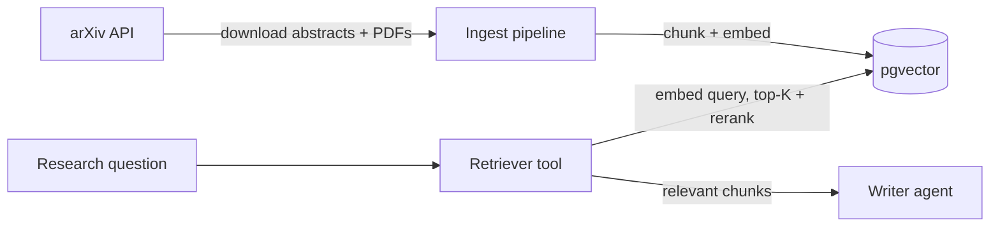

# Week 3 — RAG & Vector DB

**Goal:** Build the retrieval layer. Ingest 100+ arXiv papers into pgvector, chunk them properly, embed them, and add a Retrieval agent to your crew that grounds answers in this corpus.

**Time:** 10–14 hours. Block out a full weekend.

**You'll touch:** `src/rag/ingest.py`, `src/rag/chunking.py`, `src/rag/retriever.py`, `scripts/run_week3_ingest.py`, `scripts/run_week3.py`.

---

## Concept: what RAG actually is

**Retrieval-Augmented Generation = LLM + a search step over your own documents.**

The flow:

```
User question
   ↓
Embed the question → vector
   ↓
Vector DB returns top-K similar chunks
   ↓
Stuff chunks into the LLM prompt as context
   ↓
LLM answers using those chunks (with citations)
```

Without RAG, the LLM answers from training data: stale, generic, occasionally hallucinated.

With RAG, the LLM answers from documents *you* provide: current, specific, citable.

## Concept: chunking — the single biggest quality lever

You can't embed an entire PDF as one vector — you'd lose detail. You can't embed every sentence — you'd lose context. **Chunking** is splitting documents into ~200–800 token pieces that each embed as one vector.

Three strategies, worst to best:

1. ❌ **Fixed character count** — splits mid-sentence, breaks meaning.
2. ⚠️ **Recursive character splitting** — respects newlines/sentences. CrewAI/LangChain default. Fine for starting.
3. ✅ **Semantic chunking** — splits at semantic boundaries using embedding distance between adjacent sentences. Best quality.

For Week 3, use recursive with overlap. You'll graduate to semantic in Week 6 when chasing eval scores.

**Overlap matters.** If two chunks share 10–20% of their text, you don't lose context at boundaries. A claim split across the cut still appears in at least one chunk.

```python
RecursiveCharacterTextSplitter(
    chunk_size=800,        # ~200 tokens
    chunk_overlap=120,     # 15% overlap
    separators=["\n\n", "\n", ". ", " "],
)
```

## Concept: embeddings

An embedding is a vector — a list of N numbers — where semantically similar text produces similar vectors. "cat" and "kitten" are close; "cat" and "transformer" are far.

`text-embedding-004` (Google) produces 768-dimensional vectors. That's why our pgvector column is `vector(768)`. **If you switch embedding models, you must rebuild the table** with the new dimension.

Embeddings are not magic — they're trained from massive contrastive datasets. The model puts text that frequently appears in similar contexts near each other in space.

Google's embeddings are free on the same API key you use for generation — unlimited daily volume, no per-token charges. This is why we use them instead of OpenAI's `text-embedding-3-small` (which is cheap but not free).

## Concept: similarity search

To find chunks similar to a query, you:
1. Embed the query.
2. Compute distance (cosine, usually) between query vector and all stored chunk vectors.
3. Return top-K closest.

Naive implementation: O(N) per query. With 100K vectors, slow.

pgvector's **IVFFlat** index partitions the space into clusters. At query time, it only searches relevant clusters. Approximate (small accuracy loss) but ~50–100x faster. The `lists = 100` in `setup_db.sql` controls cluster count.

Rule of thumb: `lists = sqrt(N)` where N is total vectors. Rebuild the index after large ingestion runs.

## Concept: reranking — the second biggest quality lever

Embedding similarity is fast but imprecise. The 10th-closest chunk might actually be more relevant than the 1st. Why? Embeddings compress meaning into 768 numbers — some nuance is lost.

**Reranker** = a separate, smaller model that scores `(query, chunk)` pairs more carefully. Slower per pair, but you only run it on the top-K candidates.

Standard flow:
```
1. Vector search → top 20 chunks   (fast, recall-focused)
2. Rerank those 20  → top 5         (slow, precision-focused)
3. Return top 5 to the LLM
```

Recommended: **Cohere Rerank** (free tier: 1000 calls/month — plenty for the project) or **Jina Reranker** (also free tier). Both are API-based, no local model to host. We'll add this in Week 6.

## Concept: agentic RAG vs plain RAG

This is the 2026 distinction that will come up in interviews:

**Plain RAG** = one query → one retrieval → one answer. A function.

**Agentic RAG** = the agent decides whether to retrieve, how many times, can reformulate the query if results are bad, can call other tools too, and self-critiques the final answer. A state machine.

In Week 3 you build something between the two: a Retrieval agent that's *callable as a tool* by the Researcher. The Researcher decides when to use it. That's already more agentic than plain RAG. In Week 5 you'll make it fully agentic with LangGraph.

## What you're building



Files involved:

- `src/rag/ingest.py` — downloads N papers on a topic, chunks them, embeds them, stores in pgvector.
- `src/rag/chunking.py` — the chunking helper.
- `src/rag/retriever.py` — exposes vector search as a CrewAI tool.

## Step 1 — Ingest papers

```bash
python scripts/run_week3_ingest.py --topic "retrieval augmented generation" --limit 50
python scripts/run_week3_ingest.py --topic "transformer architectures" --limit 50
python scripts/run_week3_ingest.py --topic "rag evaluation" --limit 30
```

Each run:
1. Searches arXiv for `topic` → gets N papers
2. Downloads abstracts (and PDFs if you opt in)
3. Chunks them
4. Embeds chunks via Google API (`text-embedding-004`)
5. Inserts rows into `papers` and `chunks` tables

Expect 2–4 minutes for 50 papers (abstracts only). Google's embedding API is fast and batched. PDF extraction is slower — use `pypdf` or `pymupdf`.

**Verify ingestion:**

```sql
SELECT count(*) FROM papers;        -- should be ~130
SELECT count(*) FROM chunks;        -- should be ~1000-5000
SELECT chunk_index, left(content, 100)
  FROM chunks WHERE arxiv_id = '2501.12345' ORDER BY chunk_index LIMIT 3;
```

## Step 2 — Test retrieval

Before plugging it into the crew, query it directly:

```python
from src.rag.retriever import vector_search
hits = vector_search("how do rerankers improve rag", top_k=5)
for h in hits:
    print(h["score"], h["content"][:200])
```

Read the chunks returned. Are they actually relevant? If not, your chunking is off (chunks too large = noise; too small = lost context).

## Step 3 — Add Retrieval to the crew

Now register the retriever as a CrewAI tool and add a 4th agent (or just give the tool to the existing Researcher). Updated flow:

```
Planner → Researcher (has arxiv_search + vector_search tools) → Writer
```

The Researcher now has **two retrieval sources**. The arXiv tool fetches fresh papers; the vector_search tool retrieves from your local corpus. The agent decides which to use when. This is the first taste of real reasoning.

## Step 4 — Compare

Run the same question twice — once with vector_search disabled, once with it enabled. Compare:

- Number of citations
- Specificity of claims
- Hallucination rate

If your ingest was on-topic, vector_search results should dominate.

## Checkpoint

Done with Week 3 when:

- [ ] ≥100 papers ingested
- [ ] ≥1000 chunks in the DB
- [ ] Direct `vector_search` returns relevant chunks for 5 test queries
- [ ] The crew uses both `arxiv_search` and `vector_search` on the same question
- [ ] Output cites real arXiv IDs from your DB (verify a few!)
- [ ] You can explain the difference between vector search and reranking

## Things to try

1. **Vary chunk size.** Rebuild with 400, 800, 1600 chars. Same questions. Which is best?
2. **Vary `top_k`.** Try 3, 5, 10, 20. More isn't better — context bloat hurts.
3. **Bad query test.** Query for a topic *not* in your corpus. Does retrieval gracefully return weak matches, or does it pull bad chunks?
4. **Metadata filter.** Add `WHERE published_at > '2024-01-01'` to retrieval. Recent-only mode.

## Common pitfalls

**Embedding takes forever.** The langchain wrapper batches internally via `embed_documents()`. If you're embedding one-at-a-time in a loop, switch to batched. Google's API accepts batches up to 100 documents per call.

**Vector search returns nothing.** Usually IVFFlat index needs more data. With <100 chunks, `lists=100` is over-partitioned. Drop to `lists=10` or remove the index (sequential scan) until you have data.

**Retrieved chunks are all from the same paper.** Add a diversity step: take top-5 chunks but only 2 max per paper. Or use MMR (Maximal Marginal Relevance).

**LLM ignores retrieved context.** Two causes: (1) chunks are too noisy — improve chunking; (2) prompt doesn't force grounding — add "Answer ONLY from the provided context. If the context doesn't cover it, say so."

**Dimension mismatch.** You changed embed model without rebuilding the table. `DROP TABLE chunks; CREATE TABLE chunks ...` with the new `vector(N)`.

## Reading

- LangChain RAG concepts: <https://python.langchain.com/docs/concepts/rag/>
- pgvector README: <https://github.com/pgvector/pgvector>
- The original RAG paper (skim): <https://arxiv.org/abs/2005.11401>
- Anthropic's "Contextual Retrieval" post (read fully): <https://www.anthropic.com/news/contextual-retrieval>

## Next step

→ Continue to [`05-week4-mcp.md`](./05-week4-mcp.md).
