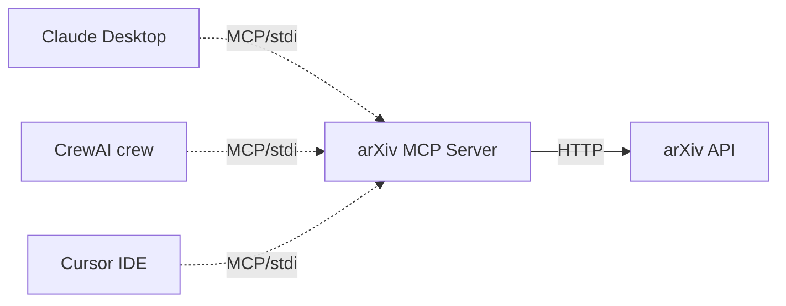

# Week 4 — Build an MCP Server

**Goal:** Wrap the arXiv tool as a standalone **MCP server** that any MCP-compatible client (Claude Desktop, Cursor, your crew, future agents) can use.

**Time:** 4–6 hours.

**You'll touch:** `src/mcp_server/server.py`.

**Why this week matters:** This is the single highest-leverage thing on your resume from this whole project. Most candidates have written tools; very few have shipped an MCP server. It signals you understand where the industry is going.

---

## Concept: what is MCP?

**Model Context Protocol** is an open standard for connecting LLMs to tools, data, and prompts. Think of it as **USB-C for AI agents**: one protocol, many implementations.

Before MCP, every framework had its own tool format:
- LangChain: `BaseTool` Python class
- CrewAI: also `BaseTool` (compatible by accident)
- OpenAI Assistants: JSON schema + Python function
- Custom: whatever you wrote

This meant tools weren't portable. A great GitHub-search tool written for LangChain couldn't be used by an OpenAI Assistant without rewriting.

MCP fixes this. You write the tool **once**, expose it as an MCP server, and any MCP client uses it.

In December 2025 the protocol was donated to the Linux Foundation, and both OpenAI and Google adopted it. It's the standard now.

## Concept: server vs client

- **MCP server** = exposes capabilities (tools, resources, prompts). You're building this.
- **MCP client** = consumes capabilities. Claude Desktop, Cursor, your CrewAI crew, etc.

Communication is over **stdio** (subprocess) or **HTTP/SSE** (network). Stdio is easier to start with.

## Concept: the three primitives

| Primitive   | What it is                                | Example                          |
| ----------- | ----------------------------------------- | -------------------------------- |
| **Tool**    | A function the LLM can call               | `arxiv_search(query)`            |
| **Resource** | Data the LLM can read (file-like)        | `arxiv://2501.12345` (paper PDF) |
| **Prompt**  | A reusable prompt template the user picks | `summarize_paper(arxiv_id)`      |

You'll focus on **tools** in Week 4. Resources and prompts are quick adds once tools work.

## What you're building



One server, many consumers. Each consumer "sees" the same tools.

## The skeleton

Python MCP SDK: `pip install mcp` (already in requirements.txt).

```python
# src/mcp_server/server.py
from mcp.server.fastmcp import FastMCP

mcp = FastMCP("arxiv-research")   # server name

@mcp.tool()
def arxiv_search(query: str, max_results: int = 5) -> str:
    """Search arXiv for papers. Returns titles, authors, abstracts, IDs."""
    # ... same logic as src/tools/arxiv_search.py
    return formatted_results

@mcp.tool()
def fetch_paper(arxiv_id: str) -> str:
    """Fetch full abstract for a specific arXiv ID."""
    # ...
    return abstract

if __name__ == "__main__":
    mcp.run()   # stdio by default
```

That's it. The `@mcp.tool()` decorator turns a Python function into an MCP tool. The docstring becomes the tool description the LLM sees.

## Step 1 — Write the server

In `src/mcp_server/server.py`, add 2–3 tools:
1. `arxiv_search(query, max_results)` — search
2. `fetch_paper(arxiv_id)` — get one paper's full abstract
3. *(optional)* `vector_search(query, top_k)` — query your pgvector

Use the same logic from `src/tools/arxiv_search.py` and `src/rag/retriever.py`. The point is to **reuse**, not rewrite.

## Step 2 — Test with the MCP Inspector

The inspector is a UI for poking at MCP servers. Run:

```bash
npx @modelcontextprotocol/inspector python -m src.mcp_server.server
```

It opens a browser tab where you can:
- See the tool list
- Call each tool with arguments
- View the response

If your tool shows up and responds correctly here, **it will work in any MCP client**.

## Step 3 — Connect to Claude Desktop

Edit `~/Library/Application Support/Claude/claude_desktop_config.json` (Mac) or the equivalent on your OS:

```json
{
  "mcpServers": {
    "arxiv-research": {
      "command": "python",
      "args": ["-m", "src.mcp_server.server"],
      "cwd": "/absolute/path/to/deep-research-agent",
      "env": {
        "PYTHONPATH": "/absolute/path/to/deep-research-agent"
      }
    }
  }
}
```

Restart Claude Desktop. The hammer icon in the input bar should show your tools. Ask: *"Use your arxiv tools to find papers on mixture of experts."* Claude will call your server.

**This is the demo.** Record it. Put it on the project's README.

## Step 4 — Connect to your CrewAI crew

CrewAI 1.10+ has native MCP client support. Replace your `ArxivSearchTool()` with an MCP-loaded version. Approximate API:

```python
from crewai_tools import MCPServerAdapter

adapter = MCPServerAdapter(
    {"command": "python", "args": ["-m", "src.mcp_server.server"]}
)
tools = adapter.tools   # auto-discovered from your server

researcher = Agent(..., tools=tools)
```

(Check `crewai_tools` docs for exact current API — it has shifted over recent versions.)

Now your crew and Claude Desktop use the **same tool implementation**. Change a tool, both update.

## Checkpoint

Done with Week 4 when:

- [ ] MCP server runs (`python -m src.mcp_server.server` doesn't crash)
- [ ] Inspector shows ≥2 tools
- [ ] Claude Desktop can call your tools
- [ ] Your CrewAI crew loads tools via MCPServerAdapter
- [ ] You've recorded a 30-second demo of Claude Desktop using your server
- [ ] You can explain to a friend why MCP matters (try it!)

## Things to try

1. **Add a Resource.** Expose `arxiv://{id}` URIs that return the abstract for that ID. Now Claude Desktop can `@-mention` papers.
2. **Add a Prompt.** Build a `summarize_paper` prompt template — appears as a slash command in Claude Desktop.
3. **Publish to npx-style.** Push your repo, then anyone can run `npx @yourgh/arxiv-mcp` — well, the Python equivalent with `pipx`. Adds it to a public list of MCP servers.

## Common pitfalls

**"Server not connecting" in Claude Desktop.** Almost always a path issue. Use absolute paths. Check the log at `~/Library/Logs/Claude/mcp*.log` on Mac.

**Inspector shows tools but Claude doesn't.** Restart Claude Desktop fully. The config is loaded once at startup.

**Tool description ignored.** Docstrings must be informative. `"""Search."""` won't cut it.

**Stdio vs HTTP confusion.** Stdio is one-client-one-process. HTTP/SSE is multi-client. Start with stdio for everything except prod.

## Reading

- MCP spec (read fully — it's short): <https://modelcontextprotocol.io/specification>
- Anthropic's reference servers (real production code, browse): <https://github.com/modelcontextprotocol/servers>
- Python SDK README: <https://github.com/modelcontextprotocol/python-sdk>

## Next step

→ Continue to [`06-week5-langgraph.md`](./06-week5-langgraph.md).
