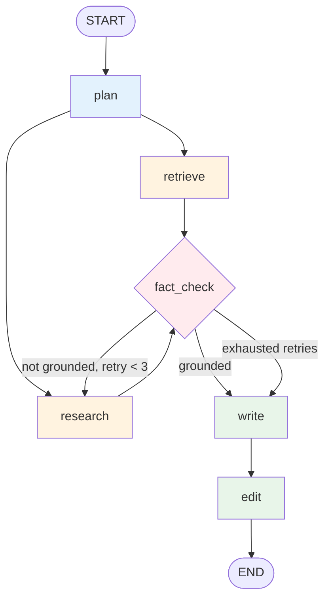

# Week 5 — Migrate to LangGraph

**Goal:** Rebuild the workflow as a stateful graph with explicit nodes, conditional edges, and a fact-checker loop. Feel why production teams choose LangGraph over CrewAI for complex workflows.

**Time:** 8–10 hours.

**You'll touch:** `src/graph/workflow.py`, `scripts/run_week5.py`.

---

## Concept: why graphs, not crews?

CrewAI's sequential model is fine when:
- The flow is linear (A → B → C)
- Every step is reached unconditionally
- You don't need to revisit a step

It breaks when you need:
- **Loops** — "if the fact-check fails, send back to Writer"
- **Branching** — "if confidence < 0.7, escalate to human"
- **Parallel** — "run 3 researchers concurrently, then merge"
- **Checkpoints** — "save state mid-run so we can resume after a crash"
- **Audit trails** — "show me exactly what data flowed through each step"

LangGraph models all of this explicitly. You define a graph; LangGraph executes it.

## Concept: state, nodes, edges

```python
class ResearchState(TypedDict):
    question: str
    sub_questions: list[str]
    retrieved_chunks: list[dict]
    draft: str
    fact_check_result: dict
    iterations: int
    final_report: str
```

**State** is a typed dict that flows through the graph. Every node receives state, returns *updates* to merge in.

**Nodes** are Python functions: `state -> partial_state_update`. Each node does one job.

**Edges** connect nodes. `"plan" -> "research"` means after `plan` finishes, run `research`.

**Conditional edges** are functions: `state -> next_node_name`. They look at state and decide where to go next.

## Concept: the reducer

When two nodes write to the same state field, who wins? LangGraph uses a **reducer** function per field:

```python
from typing import Annotated
from operator import add

class State(TypedDict):
    retrieved_chunks: Annotated[list, add]   # appends, doesn't overwrite
```

For parallel research (multiple researchers running concurrently), this matters a lot — each researcher *appends* their findings to the shared list rather than overwriting.

## What you're building



Same agents as Weeks 2–3, but now with:
- **Parallel** retrieve + research
- **Conditional loop** on fact-check
- **Iteration cap** to prevent infinite loops

## Skeleton code

```python
# src/graph/workflow.py
from typing import Annotated, TypedDict
from operator import add
from langgraph.graph import StateGraph, START, END

class ResearchState(TypedDict):
    question: str
    sub_questions: list[str]
    chunks: Annotated[list, add]
    draft: str
    fact_check: dict
    iterations: int
    final_report: str

def plan_node(state: ResearchState) -> dict:
    # Call LLM to decompose question into sub-questions
    sub_qs = decompose(state["question"])
    return {"sub_questions": sub_qs}

def retrieve_node(state: ResearchState) -> dict:
    chunks = vector_search_many(state["sub_questions"])
    return {"chunks": chunks}

def research_node(state: ResearchState) -> dict:
    chunks = arxiv_search_many(state["sub_questions"])
    return {"chunks": chunks}

def write_node(state: ResearchState) -> dict:
    draft = synthesize(state["question"], state["chunks"])
    return {"draft": draft}

def fact_check_node(state: ResearchState) -> dict:
    result = verify_claims(state["draft"], state["chunks"])
    return {
        "fact_check": result,
        "iterations": state["iterations"] + 1,
    }

def should_retry(state: ResearchState) -> str:
    if state["fact_check"]["grounded"]:
        return "write"
    if state["iterations"] >= 3:
        return "write"            # give up, ship the draft
    return "research"             # loop back

def edit_node(state: ResearchState) -> dict:
    polished = polish(state["draft"])
    return {"final_report": polished}

# Build the graph
graph = StateGraph(ResearchState)
graph.add_node("plan", plan_node)
graph.add_node("retrieve", retrieve_node)
graph.add_node("research", research_node)
graph.add_node("fact_check", fact_check_node)
graph.add_node("write", write_node)
graph.add_node("edit", edit_node)

graph.add_edge(START, "plan")
graph.add_edge("plan", "retrieve")    # parallel branches
graph.add_edge("plan", "research")
graph.add_edge("retrieve", "fact_check")
graph.add_edge("research", "fact_check")
graph.add_conditional_edges("fact_check", should_retry, {
    "write": "write",
    "research": "research",
})
graph.add_edge("write", "edit")
graph.add_edge("edit", END)

app = graph.compile()
```

Run it:

```python
result = app.invoke({"question": "...", "iterations": 0})
print(result["final_report"])
```

## Concept: checkpoints

LangGraph can persist state to a backing store (memory, SQLite, Postgres). Crash mid-run? Resume from the last checkpoint.

```python
from langgraph.checkpoint.postgres import PostgresSaver

checkpointer = PostgresSaver.from_conn_string(DATABASE_URL)
app = graph.compile(checkpointer=checkpointer)

# Resume a previous run by thread_id
config = {"configurable": {"thread_id": "user-42-session-1"}}
app.invoke(input_or_None, config=config)
```

For a research agent that takes 30 seconds per run, this is overkill. For a 5-minute one with expensive tool calls, it's a lifesaver. Implement it anyway — it's a portfolio detail.

## Concept: streaming

```python
for event in app.stream(input, config=config):
    print(event)
```

You get one event per node completion. Pipe these to a frontend → users see progress. Essential UX for long-running workflows. Week 8 covers this.

## Concept: human-in-the-loop

```python
graph.add_node("human_approval", interrupt_after=["write"])
```

The graph pauses before the next node, lets a human review/edit state, then resumes. Critical for high-stakes flows (legal, medical, financial). For research, optional but a nice add.

## Checkpoint

Done with Week 5 when:

- [ ] The graph runs end-to-end on a fresh question
- [ ] You can see the fact-check loop fire (force it: ingest one paper, ask a question outside that domain, watch retries)
- [ ] Streaming works — you see node events as they complete
- [ ] Checkpoints saved to Postgres (verify in the DB)
- [ ] You can explain why a graph beats a sequential crew here

## Things to try

1. **Add a Skeptic node** that critiques the Writer's draft. Conditional edge: critique-passed → edit, critique-failed → write.
2. **Parallel researchers.** Spawn one researcher per sub-question concurrently. Use the `add` reducer to merge results.
3. **Cycle detection.** Try to write an infinite loop. LangGraph has cap protection — see how it handles it.
4. **Visualize.** `app.get_graph().draw_mermaid_png()` produces a PNG of your graph.

## Common pitfalls

**Forgetting reducers.** Two nodes write to the same list field, the second overwrites the first. Always `Annotated[list, add]` for shared lists.

**Conditional edge function returns wrong name.** The string must match a node name exactly. Typos = runtime crash.

**Iterations counter not incremented.** Always `+1` in the node, not in the conditional. Conditionals should be pure functions of state.

**State mutation.** Never mutate state in place. Always return a dict of *updates*. LangGraph merges them.

**Token cost explodes.** Each loop iteration = full re-call. Cap iterations aggressively (3 max is sane for fact-checking).

## Reading

- LangGraph concepts (read all of these): <https://langchain-ai.github.io/langgraph/concepts/>
- Multi-agent tutorials: <https://langchain-ai.github.io/langgraph/tutorials/multi_agent/>
- The "Reflection" pattern paper: <https://arxiv.org/abs/2303.11366>

## Next step

→ Continue to [`07-week6-evals.md`](./07-week6-evals.md).
